<div align="center">

# RDTU

### Does LLM-based Time Series Forecasting Really Need Pre-Alignment?

[**Complete PDF**](supplement/RDTU-Supplementary.pdf) · [**Original tables**](assets/tables/README.md) · [**CSV data**](data/README.md)

</div>

<a id="method"></a>

### Forecasting-paradigm comparison

[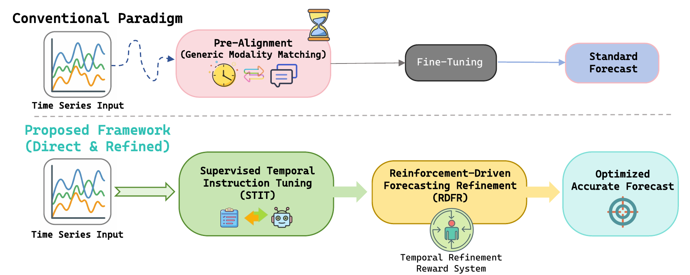](assets/figures/Intro.pdf)

Conventional approaches rely on pre-alignment modules with limitations of granularity mismatch and architectural overhead to bridge modality gaps, when our proposed framework **RDTU** adopts a direct unification strategy, bypassing pre-alignment via **Supervised Temporal Instruction Tuning (STIT)** and strictly enforcing precision through **Reinforcement-Driven Forecasting Refinement (RDFR)**.

## Method and sample selection

[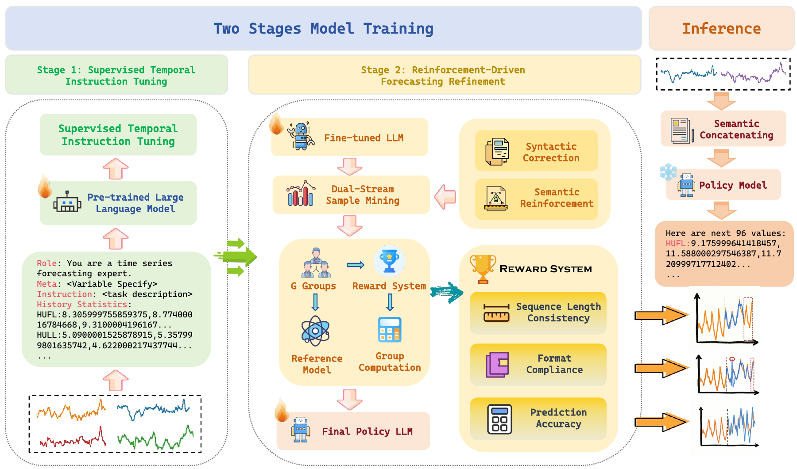](assets/figures/Method.pdf)

**STIT.** Historical observations are serialized as numerical text and combined with a forecasting role, domain metadata and target horizon. Qwen2.5-7B-Instruct is adapted by supervised instruction tuning with LoRA.

**RDFR.** The STIT model is refined with Group Relative Policy Optimization (GRPO). The reward combines sequence length, numerical format and prediction accuracy:

```math
R_{total}=0.1R_{len}+0.1R_{fmt}+0.8R_{acc}.
```

The length reward decays exponentially with the difference between predicted and requested sequence lengths. The format reward checks numeric validity, floating-point structure and precision, with weights 0.2, 0.3 and 0.5. The accuracy reward is exp(−10 × MSE). The length decay factor is 0.5.

### Hard sample mining

[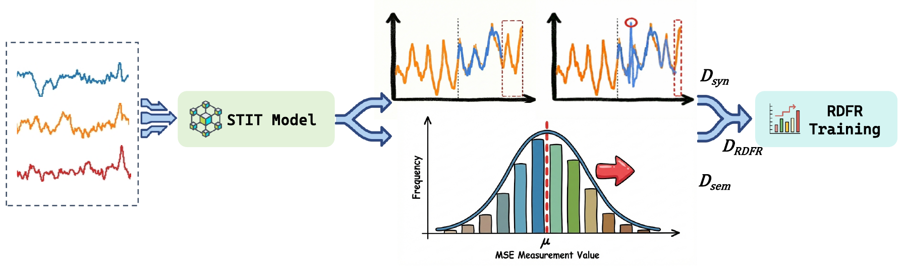](assets/figures/RDFR.pdf)

**Sample selection.** The syntactic stream prioritizes explicit formatting failures, then fills its quota with low-format-score examples. The semantic stream selects examples with MSE above the dataset mean and samples across error bins in proportion to their density. The union forms the RDFR training set.

<details>
<summary>Complete sample-mining algorithm</summary>

```text
Input: training pairs D = {(x_i, y_i)}, STIT policy pi, quotas N_syn and N_sem
Output: RDFR training set D_RDFR

1. Inference and evaluation
   P_error = empty set
   For each (x_i, y_i) in D:
       Generate prediction y_hat_i using pi(x_i).
       Compute format score S_fmt_i and MSE loss L_mse_i.
       If a specified error pattern is detected (for example, a missing decimal point):
           Add (x_i, y_i) to P_error.

2. Syntactic correction
   If |P_error| > N_syn:
       D_syn = Sample(P_error, N_syn).
   Otherwise:
       N_remain = N_syn - |P_error|.
       P_rank = TopK(D excluding P_error, key = -S_fmt, k = N_remain).
       D_syn = union(P_error, P_rank).

3. Semantic reinforcement
   Compute mean MSE mu_mse over D.
   R_focus = {(x_i, y_i) in D where L_mse_i > mu_mse}.
   Partition R_focus into K bins based on MSE density.
   D_sem = empty set.
   For each bin k:
       Set n_k = N_sem * |Bin_k| / sum_j |Bin_j|.
       Add Sample(Bin_k, n_k) to D_sem.

4. Fusion
   D_RDFR = union(D_syn, D_sem).
   Return D_RDFR.
```

</details>

### Reward equations

#### Temporal refinement rewards

To align the model’s policy with the standards of time-series forecasting, we employ Group Relative Policy Optimization (GRPO)  [DeepSeek-AI et al., 2025](docs/references.md#deepseekai2025deepseekr1) as our Reinforcement Forecasting Refinement framework. Therefore, we design a forecasting refinement reward function $`R_{total}`$ comprising three distinct components, each targeting a specific failure mode observed in STIT models.

#### Sequence Length Consistency Reward ($`R_{len}`$).

To mitigate "counting failures" where models drift from the required horizon, we replace standard linear penalties, which often lack sensitivity to "off-by-one" errors, with a non-linear exponential penalty. This acts as a soft constraint, imposing sharp penalties for minimal deviations to enforce rapid convergence to the target length $`L_{target}`$:

```math
R_{len} = \exp(-\alpha \cdot |L_{pred} - L_{target}|)
```

where $`\alpha`$ controls reward sensitivity, ensuring exact length adherence for high scores.

#### Format Compliance Reward ($`R_{fmt}`$).

To overcome the "sparse signal" problem where binary validity checks fail to distinguish between total hallucination and minor formatting errors, we employ *reward shaping*. We decompose structural compliance into progressive sub-goals to provide dense gradient feedback:


```math
\begin{aligned} R_{fmt} = \frac{1}{N} \sum_{i=1}^{N} \Big(&w_1 \cdot \mathbb{I}(\texttt{is\_number}_i) \\ &+w_2 \cdot \mathbb{I}(\texttt{is\_float}_i)+w_3 \cdot \mathbb{I}(\texttt{precision}_i)\Big) \end{aligned}
```

where $`N`$ represents the total number of predicted numerical values, and the indicator functions $`\mathbb{I}(\cdot)`$ verify token-level adherence to numeric character usage, decimal presence, and strict decimal precision as specified by the task, respectively, weighted by $`w_{\{1,2,3\}}`$.

#### Prediction Accuracy Reward ($`R_{acc}`$).

Since unbounded MSE loss can destabilize reward distributions and lacks sensitivity in high-precision regimes, we map the error to a bounded $`(0, 1]`$ interval via exponential decay. This ensures distinct feedback even as the model approaches saturation:

```math
R_{acc} = \exp(-\beta \cdot \text{MSE}(Y_{pred}, Y_{gt}))
```

where $`\beta`$ regulates the strictness of the accuracy requirement, preventing outlier dominance while maintaining significant gradient magnitude for small improvements.

The final reward is computed as a weighted sum $`R_{total} = \lambda_{len} R_{len} + \lambda_{fmt} R_{fmt} + \lambda_{acc} R_{acc}`$, balancing structural validity with regression precision.


RDTU forecasts time series directly as numerical text. **Supervised Temporal Instruction Tuning (STIT)** adapts the language model to the task; **Reinforcement-Driven Forecasting Refinement (RDFR)** improves prediction length, numerical format and accuracy. No auxiliary pre-alignment module is used.

**On this page:** [Method](#method) · [Forecasting results](#forecasting-results) · [Generalization](#generalization) · [Ablations](#ablations) · [Visual examples](#visual-examples) · [Training](#training) · [Prompt](#prompt)

The results and analysis below restore material removed or condensed for the ICASSP page limit. Key tables and figures are shown directly; the complete horizon-level tables can be expanded **on this page**. Tables are rendered from the manuscripts’ original LaTeX, with their row and column structure, precision, missing entries and color annotations preserved. Click a preview to open its vector PDF. Known source-ranking inconsistencies are documented in the [source notes](docs/source-notes.md).

<a id="forecasting-results"></a>

## Forecasting results

### Long-term forecasting

Eight multivariate benchmarks are evaluated at H ∈ {96, 192, 336, 720}; Illness uses H ∈ {24, 36, 48, 60}. The table below is the **final ICASSP table**, reporting averages over forecasting horizons. The expanded full-manuscript comparison and every horizon are available immediately below.

[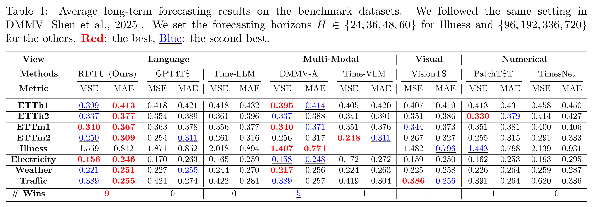](assets/tables/icassp01.pdf)

[Vector PDF](assets/tables/icassp01.pdf)

**Analysis.** RDTU improves both average MSE and MAE over Time-LLM and GPT4TS on all eight datasets. On Electricity, its MSE is 0.156 versus 0.165 for Time-LLM; on ETTh1 it is 0.399 versus 0.418 for GPT4TS. Specialized baselines remain competitive: DMMV-A has lower error on Illness, and PatchTST has lower MSE on ETTh2. The results support direct numerical generation as a competitive forecasting approach across the evaluated datasets.

[Summary CSV](data/long-term-forecasting-brief-new.csv)

<details>
<summary>Full long-term results: every horizon and all additional baselines</summary>

#### Expanded full-manuscript average comparison

[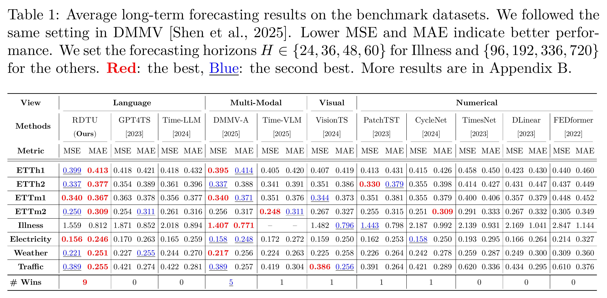](assets/tables/s01.pdf)

[Vector PDF](assets/tables/s01.pdf) · [CSV](data/long-term-forecasting-brief-new.csv)

#### Main comparison — all horizons

[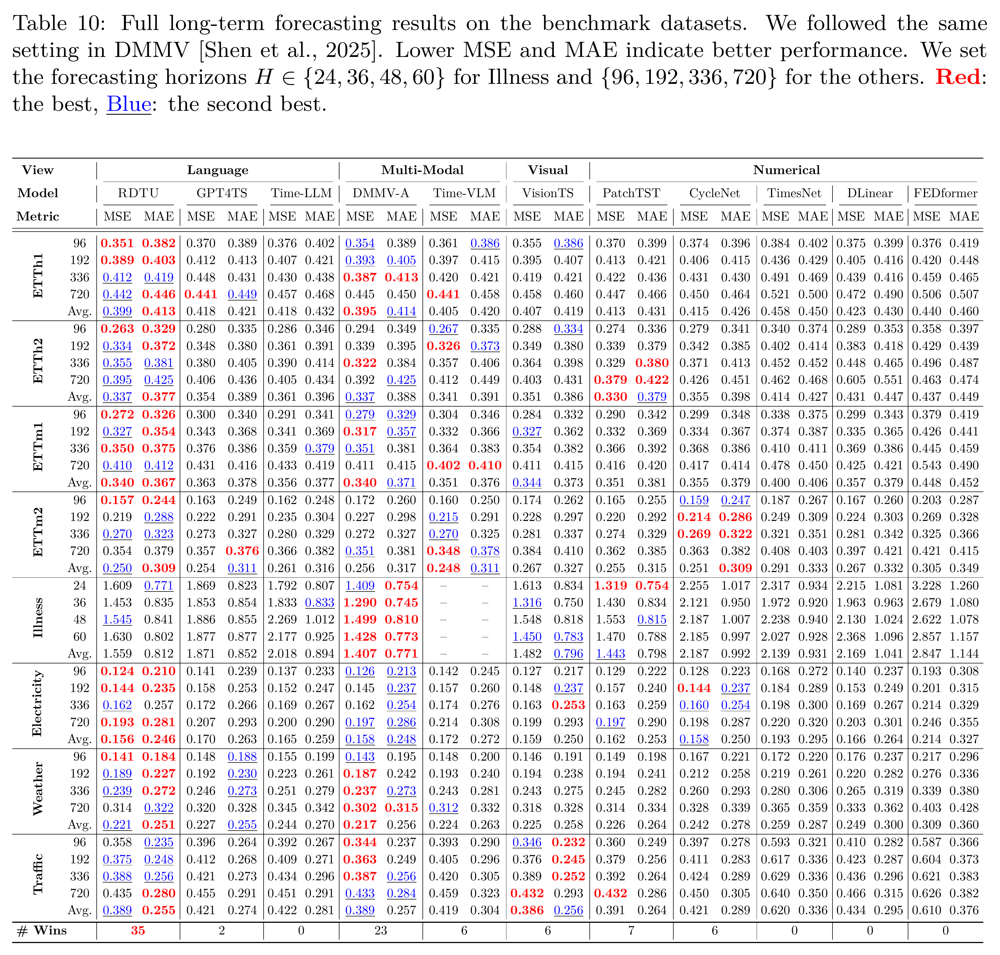](assets/tables/s10.pdf)

[Vector PDF](assets/tables/s10.pdf) · [CSV](data/long-term-forecasting-full-new.csv)

#### Additional baselines — all horizons

[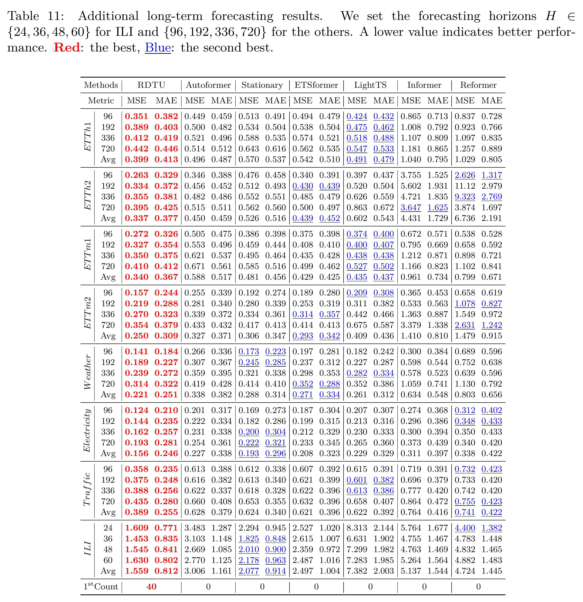](assets/tables/s11.pdf)

[Vector PDF](assets/tables/s11.pdf) · [CSV](data/long-term-forecasting-additional.csv)

The additional-baseline table preserves the source values, including Weather H = 720: RDTU MAE 0.322 versus ETSformer 0.288. Source ranking footers use an unspecified counting convention; the [source notes](docs/source-notes.md) document the differences.

</details>

### Short-term forecasting on M4

M4 is evaluated with **SMAPE, MASE and OWA**. The following values are the reported weighted averages over sampling intervals.

#### Weighted aggregate

[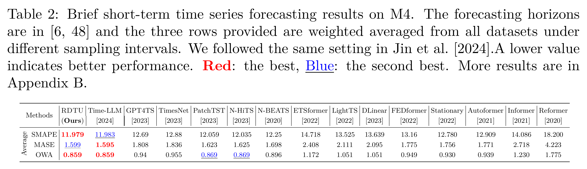](assets/tables/s02.pdf)

[Vector PDF](assets/tables/s02.pdf) · [CSV](data/short-term-forecasting-brief.csv)

**Analysis.** RDTU obtains the lowest reported SMAPE, 11.979, and matches Time-LLM's OWA of 0.859. Time-LLM has slightly lower MASE, 1.595 versus 1.599. RDTU's OWA is below GPT4TS (0.94), TimesNet (0.955), and PatchTST and N-HiTS (both 0.869).

<details>
<summary>Full M4 results: Yearly, Quarterly, Monthly, Others and Average</summary>

#### Results by sampling interval

[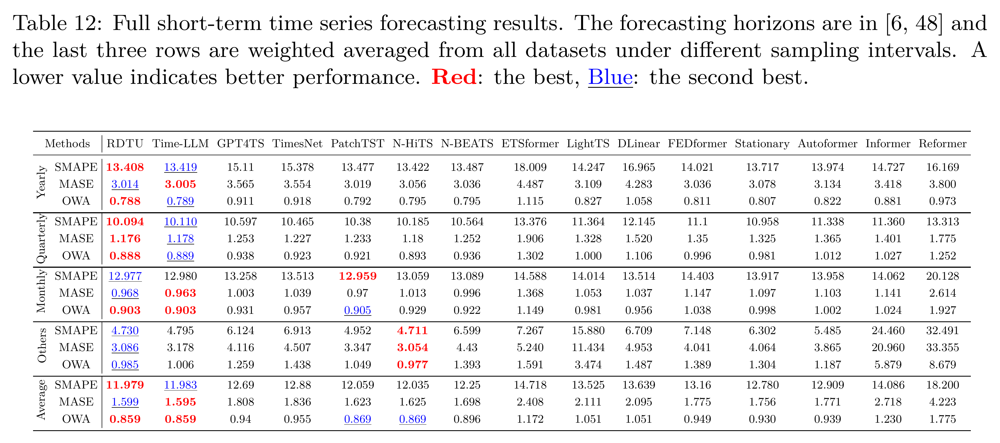](assets/tables/s12.pdf)

[Vector PDF](assets/tables/s12.pdf) · [CSV](data/short-term-forecasting.csv)

</details>

<a id="generalization"></a>

## Data efficiency and generalization

The compact comparison from the final ICASSP manuscript is shown first. The expanded full-manuscript tables below restore all baselines, both metrics and all eight transfer directions.

[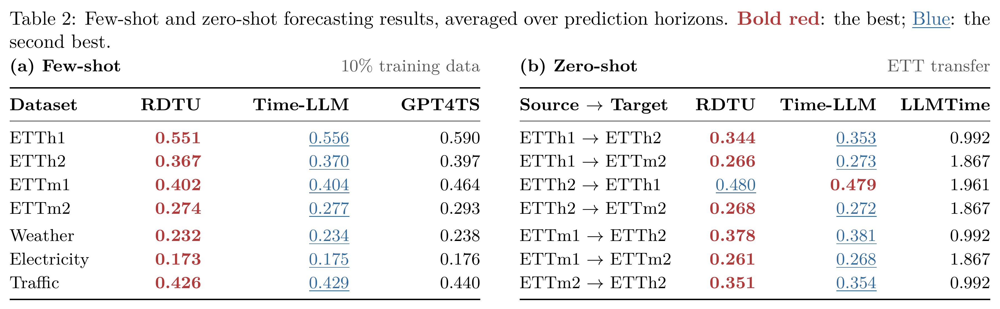](assets/tables/icassp02.pdf)

[Vector PDF](assets/tables/icassp02.pdf)

### Few-shot forecasting with 10% and 5% training data

The original full-manuscript tables below retain all reported models. The 10% summary reports horizon averages; the 5% table includes individual horizons and its Avg rows.

**10% training data**

[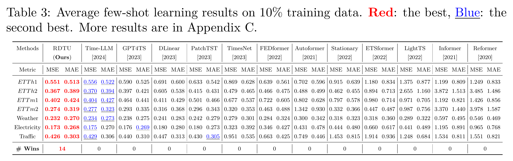](assets/tables/s03.pdf)

[Vector PDF](assets/tables/s03.pdf) · [CSV](data/few-shot-forecasting-part1-summary.csv)

**Analysis.** With 10% of the training data, RDTU has the lowest reported horizon-averaged MSE and MAE across all seven datasets in the full few-shot comparison. On ETTh1, its MSE is 0.551, compared with 0.556 for Time-LLM, 0.590 for GPT4TS and 0.633 for PatchTST.

**5% training data**

[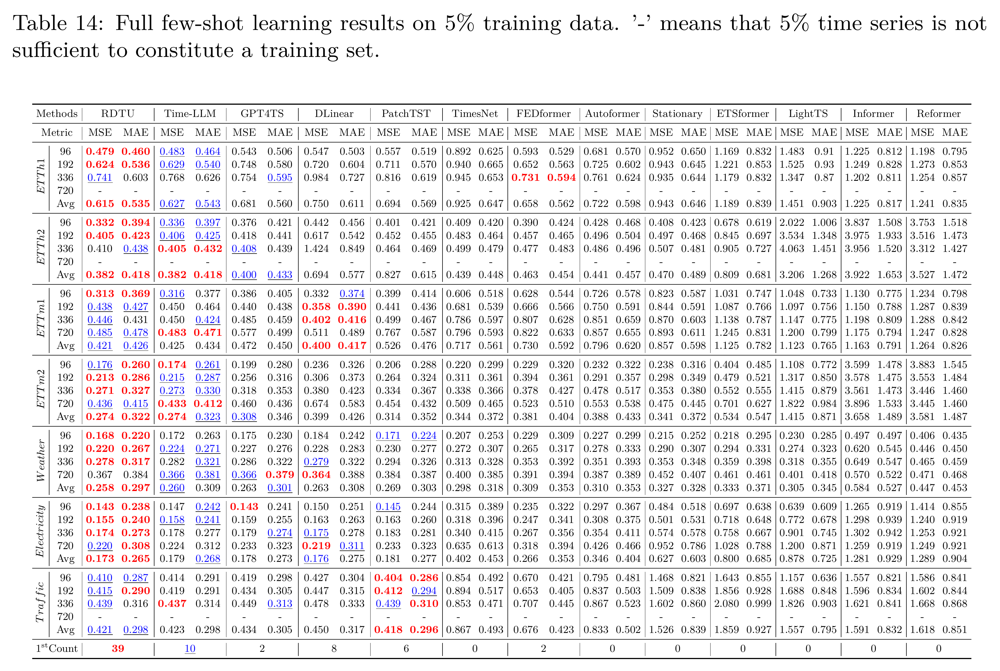](assets/tables/s14.pdf)

[Vector PDF](assets/tables/s14.pdf) · [CSV](data/few-shot-forecasting-part2-full-new.csv)

**Analysis.** RDTU remains competitive as training data is reduced further, but the advantage depends on the dataset. On Traffic, PatchTST has lower horizon-averaged MSE and MAE. Missing H = 720 results in the source remain missing; the averages shown here are the manuscript's reported values.

<details>
<summary>All few-shot baselines and horizons for the 10% and 5% settings</summary>

#### 10% data — complete average comparison

[](assets/tables/s03.pdf)

[Vector PDF](assets/tables/s03.pdf) · [CSV](data/few-shot-forecasting-part1-summary.csv)

#### 10% data — all horizons

[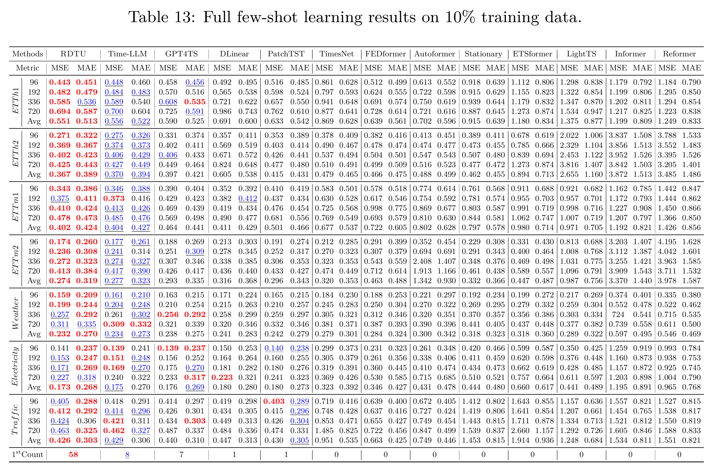](assets/tables/s13.pdf)

[Vector PDF](assets/tables/s13.pdf) · [CSV](data/few-shot-forecasting-part1-full.csv)

#### 5% data — all horizons

[](assets/tables/s14.pdf)

[Vector PDF](assets/tables/s14.pdf) · [CSV](data/few-shot-forecasting-part2-full-new.csv)

</details>

### Zero-shot transfer within the ETT family

Models are trained on the source dataset and evaluated on the target dataset. All **eight transfer directions** are included below; values are averages over horizons.

[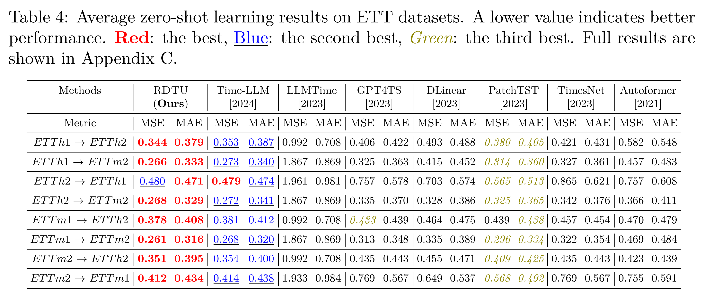](assets/tables/s04.pdf)

[Vector PDF](assets/tables/s04.pdf) · [CSV](data/zero-shot-forecasting-brief-summary.csv)

**Analysis.** RDTU has the lowest average MSE in seven of the eight directions in the full comparison. The exception is **ETTh2 → ETTh1**, where Time-LLM has 0.479 MSE versus RDTU's 0.480; RDTU has lower MAE, 0.471 versus 0.474. The eighth direction, **ETTm2 → ETTm1**, was omitted from the final compact ICASSP table and is restored here.

<details>
<summary>All zero-shot baselines and horizons for all eight directions</summary>

#### Complete average comparison

[](assets/tables/s04.pdf)

[Vector PDF](assets/tables/s04.pdf) · [CSV](data/zero-shot-forecasting-brief-summary.csv)

#### All forecasting horizons

[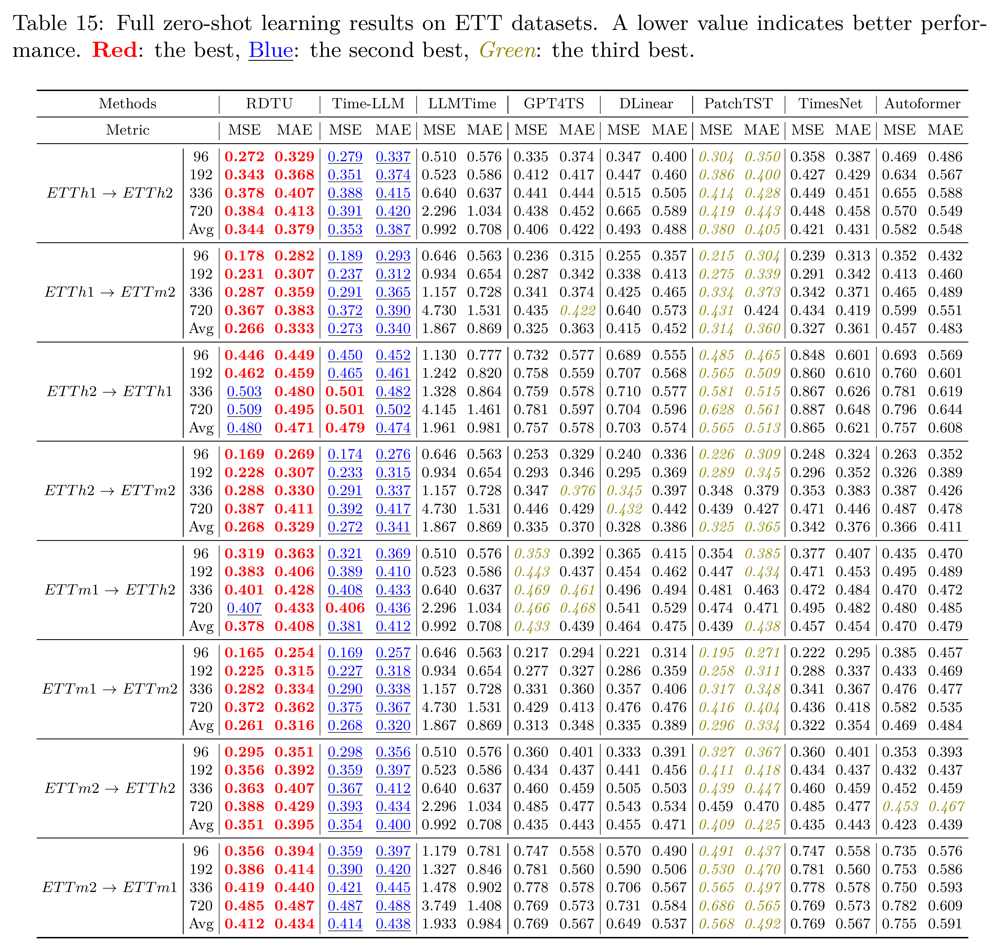](assets/tables/s15.pdf)

[Vector PDF](assets/tables/s15.pdf) · [CSV](data/zero-shot-forecasting.csv)

</details>

### Predicting beyond the training horizon

RDTU is trained only through **H = 336 with 5% data**, then directly evaluated at **H = 720**. The reference is RDTU trained at H = 720 with 10% data. Both columns are evaluated at H = 720.

[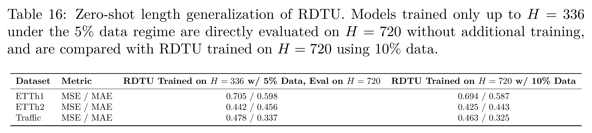](assets/tables/s16.pdf)

[Vector PDF](assets/tables/s16.pdf) · [CSV](data/length_generalization.csv)

**Analysis.** Generating a longer sequence does not require a new output head or horizon-specific retraining. Error increases relative to the H = 720 training reference, while remaining close on these three datasets. On ETTh1, the extrapolation setting obtains 0.705 MSE versus 0.694 for the reference. The comparison also changes the training-data fraction, so it is not an isolated test of horizon alone.

<a id="ablations"></a>

## Ablations and refinement efficiency

### What each reward contributes

The component ablation uses **ETTh1, H = 96**. Percentages are the source-reported change relative to STIT.

[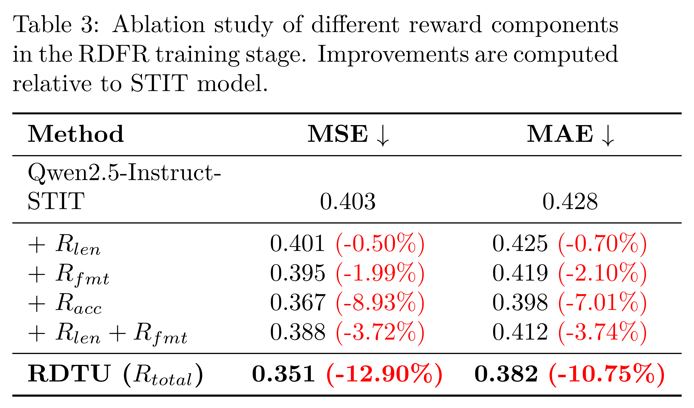](assets/tables/icassp03.pdf)

[Vector PDF](assets/tables/icassp03.pdf)

<details>
<summary>Expanded full-manuscript ablation, including the off-the-shelf model</summary>

[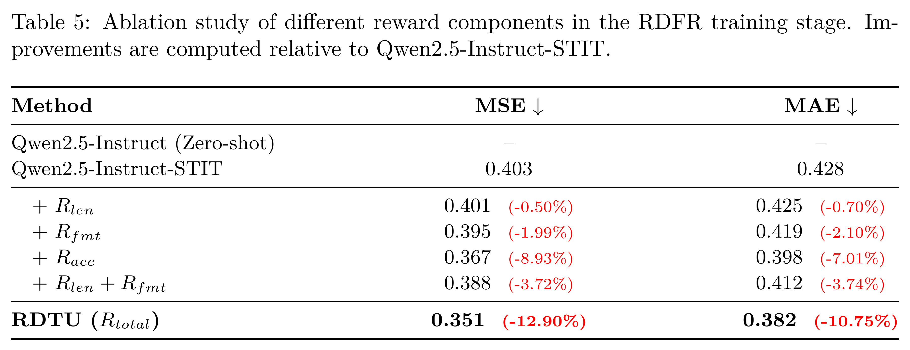](assets/tables/s05.pdf)

[Vector PDF](assets/tables/s05.pdf) · [CSV](data/ablation_02.csv)

</details>

**Analysis.** STIT produces a forecasting baseline with 0.403 MSE. The accuracy reward contributes the largest individual improvement, reaching 0.367 MSE. Combining length, format and accuracy rewards gives the lowest error in this ablation: **0.351 MSE and 0.382 MAE**, corresponding to reductions of **12.90% and 10.75%** from STIT. The off-the-shelf model's missing entries indicate that valid results were not reported.

### Why select difficult samples for RDFR?

This ablation also uses **ETTh1, H = 96** and compares refinement on the full training set with the dual-stream selected subset.

[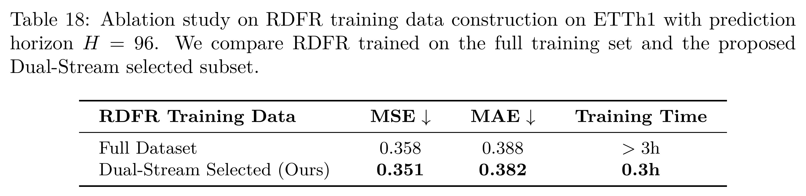](assets/tables/s18.pdf)

[Vector PDF](assets/tables/s18.pdf) · [CSV](data/rdfr_data_construction_ablation.csv)

**Analysis.** The selected subset reduces reported RDFR training time from more than 3 hours to 0.3 hours, while improving MSE from 0.358 to 0.351 and MAE from 0.388 to 0.382. In this experiment, adding all available samples increases the refinement cost without improving the final forecast.

### Reward weights and model size

[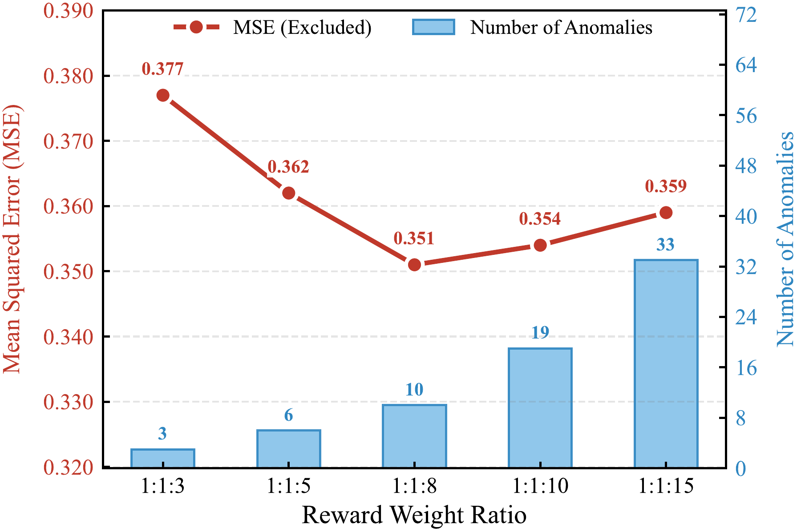](assets/figures/ablation/ablation01.pdf)

**Reward balance.** The best tested length:format:accuracy ratio is **1:1:8**, with MSE 0.351. At 1:1:3, MSE is 0.377. Increasing the accuracy weight further to 1:1:15 raises the reported anomaly count from 10 to 33, illustrating the trade-off between numerical fit and valid output structure.

[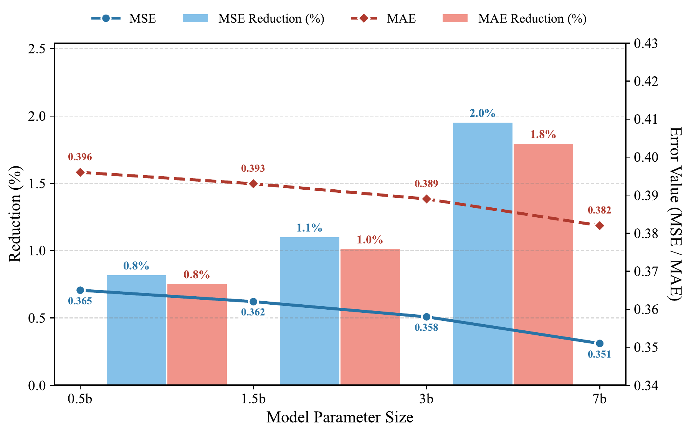](assets/figures/ablation/ablation03_combined.pdf)

**Model scaling.** The reported Qwen2.5 comparison spans 0.5B, 1.5B, 3B and 7B. ETTh1 MSE decreases from 0.365 at 0.5B to 0.351 at 7B. The figure also reports training efficiency across model sizes.

<a id="visual-examples"></a>

## Forecast examples: what RDFR changes

Each example uses **96 historical points to predict 96 future points**. STIT is shown on the left and RDTU after RDFR on the right. Click any plot to open the original vector PDF.

### ETTh1

**Prediction length** — The STIT forecast stops early; the refined model completes the requested horizon.

| STIT | RDTU (STIT + RDFR) |
| :--- | ---: |
| [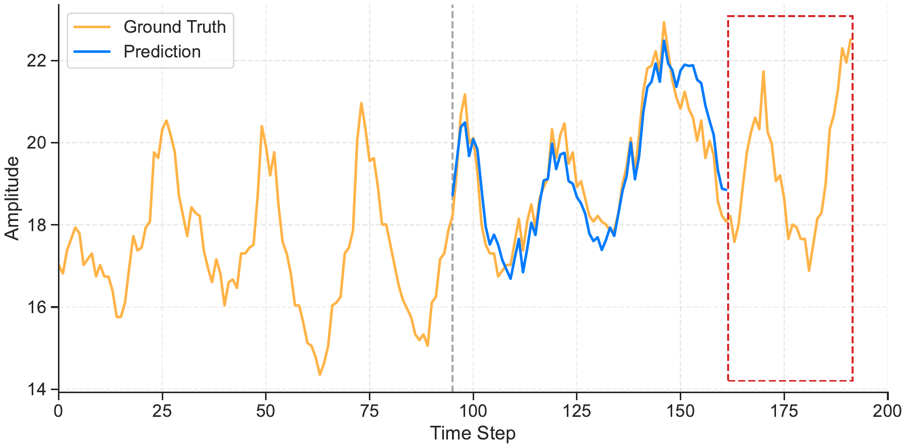](assets/figures/showcase/ground_truth_plot_01_len.pdf) | [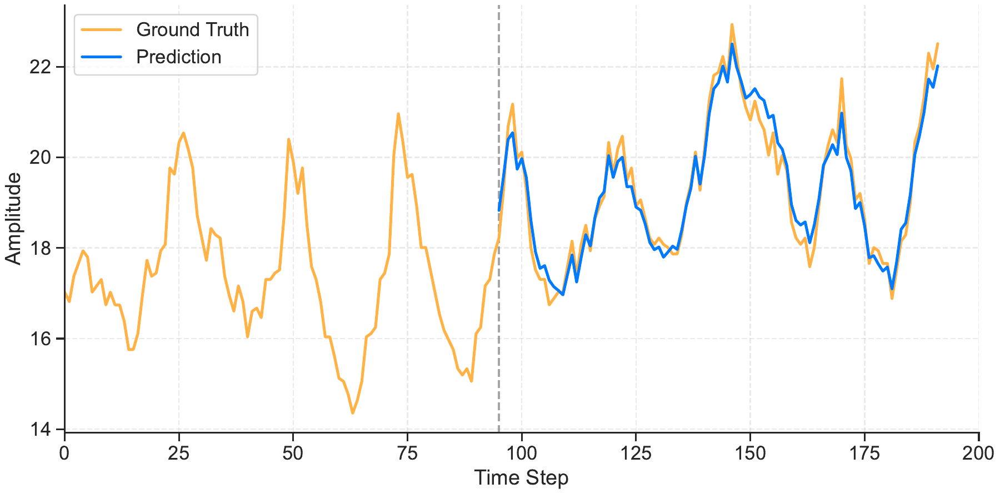](assets/figures/showcase/ground_truth_plot_01.pdf) |

**Numerical accuracy** — The refined prediction follows the local changes in the ground-truth trajectory more closely.

| STIT | RDTU (STIT + RDFR) |
| :--- | ---: |
| [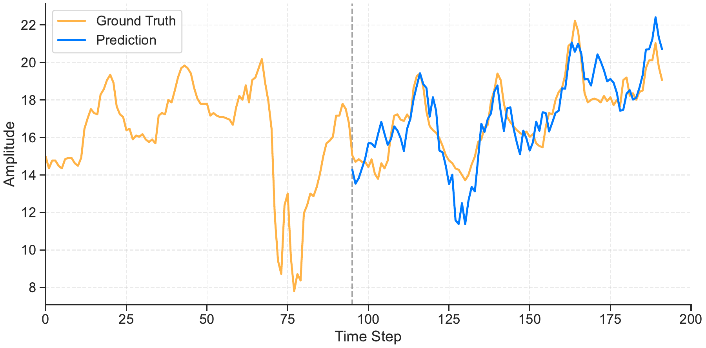](assets/figures/showcase/ground_truth_plot_03_mse.pdf) | [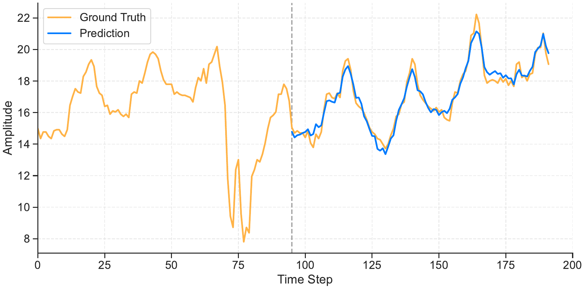](assets/figures/showcase/ground_truth_plot_03.pdf) |

**Output format** — A decimal-formatting failure produces an outlier in STIT. The refined output removes the illustrated formatting failure.

| STIT | RDTU (STIT + RDFR) |
| :--- | ---: |
| [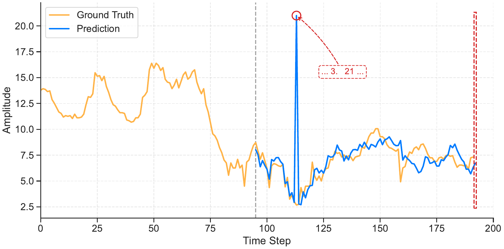](assets/figures/showcase/ground_truth_plot_05_decimal.pdf) | [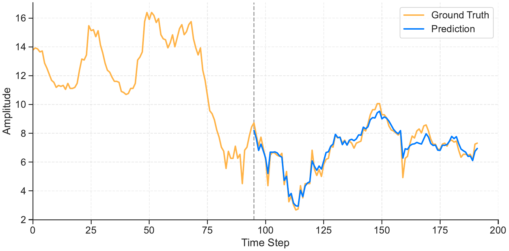](assets/figures/showcase/ground_truth_plot_05.pdf) |

### ETTh2 and ETTm1

The same three failure modes are illustrated on two additional datasets. In the ETTh2 example, a missing decimal point turns a value such as **1.25 into 125**. In ETTm1, an extra space can split a value such as **−1.75 into −1 and 75**. These are qualitative examples of output validity; the aggregate error comparisons appear in the result tables above.

<details>
<summary>ETTh2: all three STIT / RDTU comparisons</summary>

**Prediction length** — RDFR corrects the incomplete forecast in this example.

| STIT | RDTU (STIT + RDFR) |
| :--- | ---: |
| [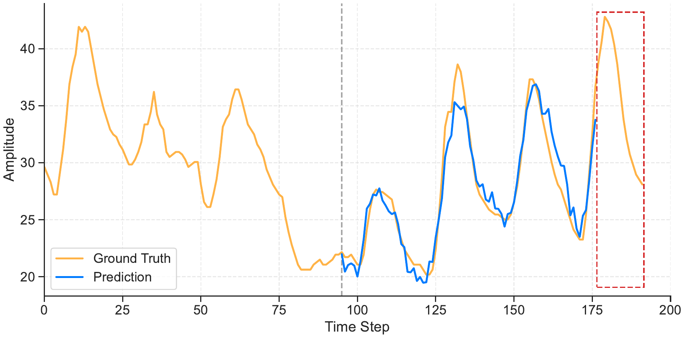](assets/figures/appendix/showcase_additional/ground_truth_plot_01_len.pdf) | [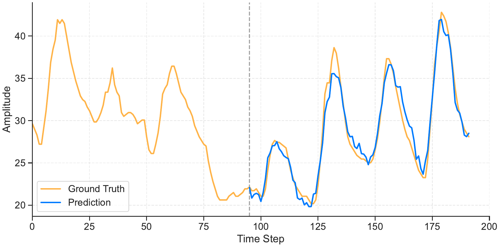](assets/figures/appendix/showcase_additional/ground_truth_plot_01.pdf) |

**Numerical accuracy** — RDFR improves the local numerical fit in this example.

| STIT | RDTU (STIT + RDFR) |
| :--- | ---: |
| [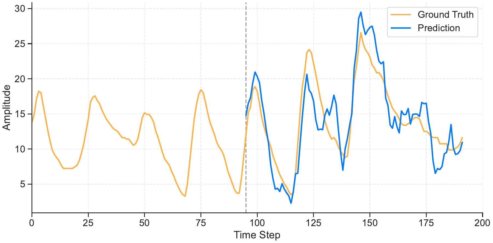](assets/figures/appendix/showcase_additional/ground_truth_plot_02_mse.pdf) | [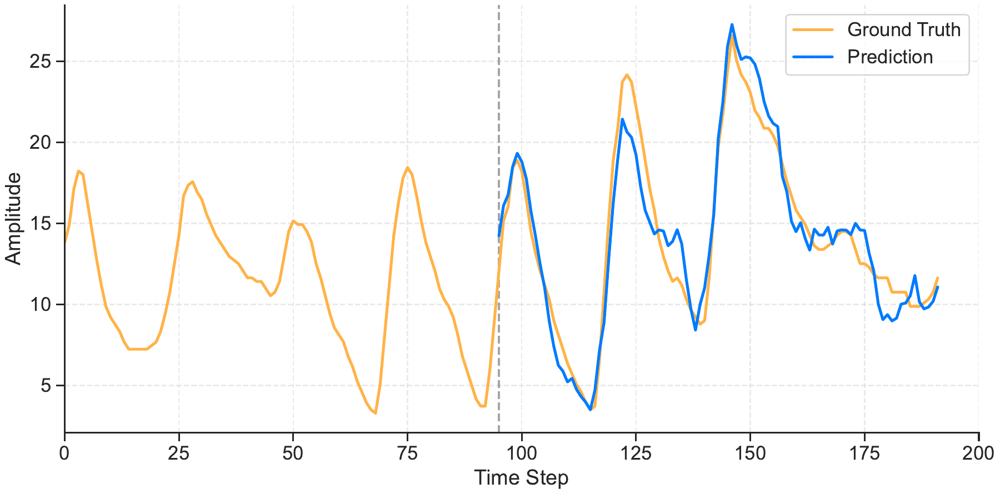](assets/figures/appendix/showcase_additional/ground_truth_plot_02.pdf) |

**Output format** — RDFR removes the illustrated decimal-formatting anomaly.

| STIT | RDTU (STIT + RDFR) |
| :--- | ---: |
| [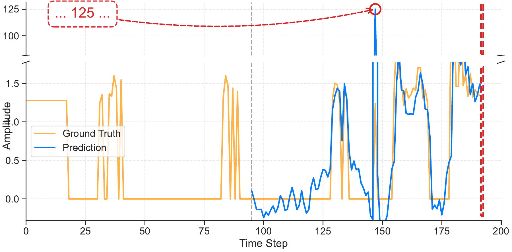](assets/figures/appendix/showcase_additional/ground_truth_plot_03_decimal.pdf) | [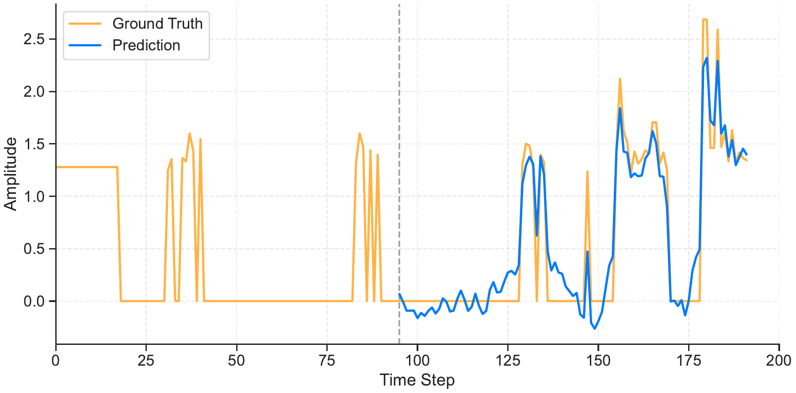](assets/figures/appendix/showcase_additional/ground_truth_plot_03.pdf) |

</details>

<details>
<summary>ETTm1: all three STIT / RDTU comparisons</summary>

**Prediction length** — RDFR corrects the incomplete forecast in this example.

| STIT | RDTU (STIT + RDFR) |
| :--- | ---: |
| [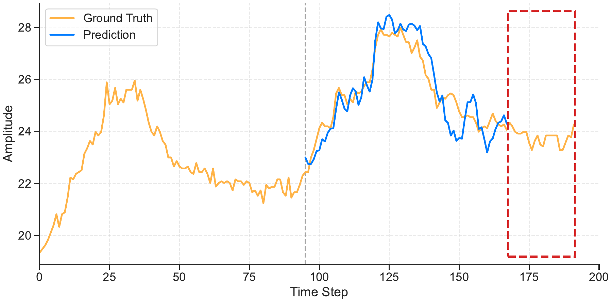](assets/figures/appendix/showcase_additional/ground_truth_plot_04_len.pdf) | [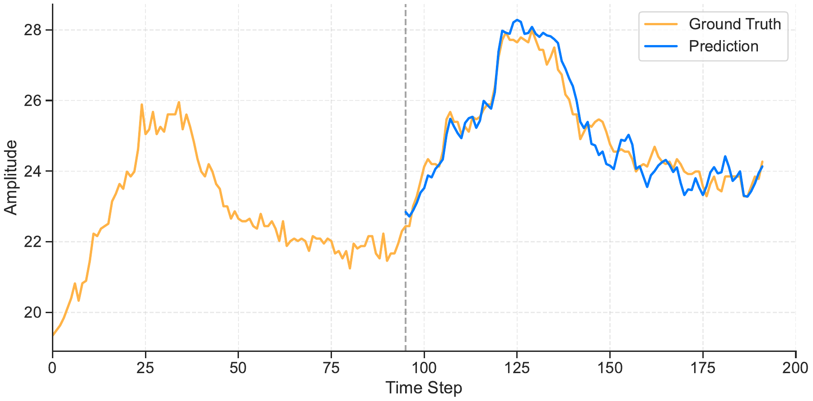](assets/figures/appendix/showcase_additional/ground_truth_plot_04.pdf) |

**Numerical accuracy** — RDFR improves the local numerical fit in this example.

| STIT | RDTU (STIT + RDFR) |
| :--- | ---: |
| [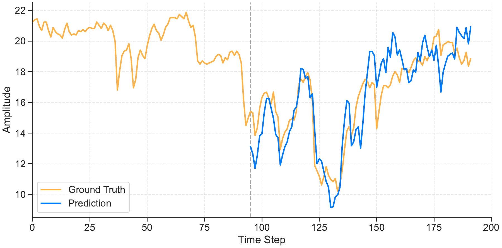](assets/figures/appendix/showcase_additional/ground_truth_plot_05_mse.pdf) | [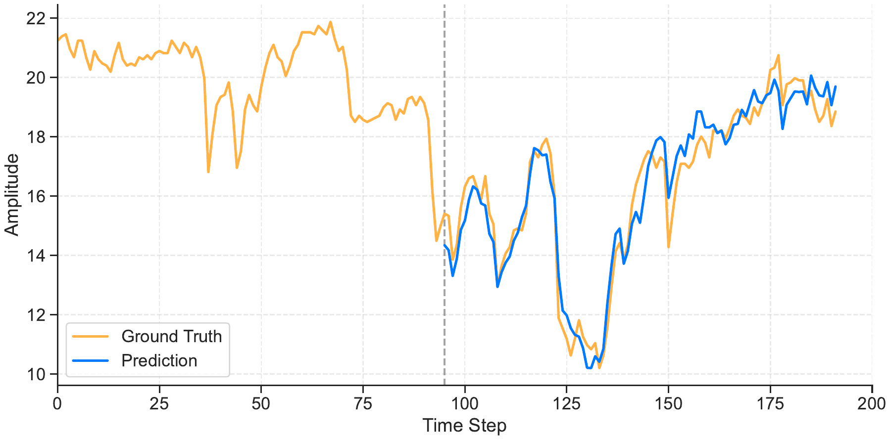](assets/figures/appendix/showcase_additional/ground_truth_plot_05.pdf) |

**Output format** — RDFR removes the illustrated decimal-formatting anomaly.

| STIT | RDTU (STIT + RDFR) |
| :--- | ---: |
| [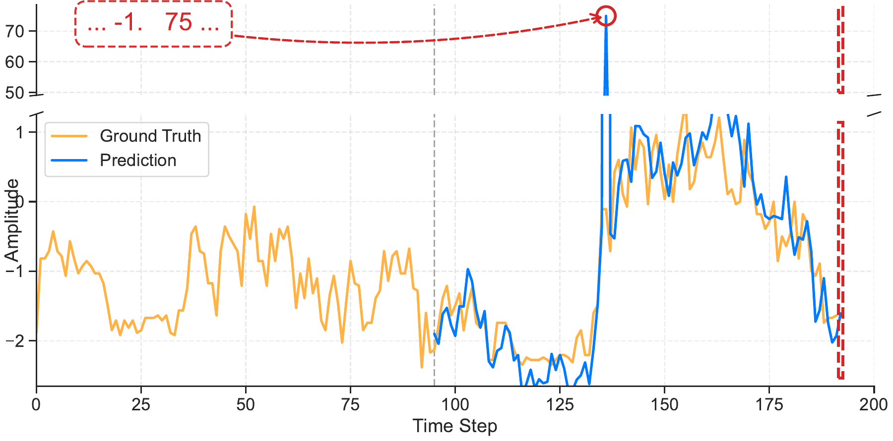](assets/figures/appendix/showcase_additional/ground_truth_plot_06_decimal.pdf) | [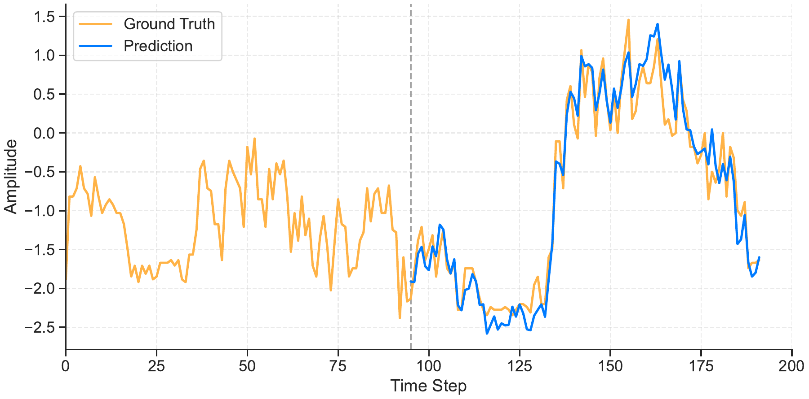](assets/figures/appendix/showcase_additional/ground_truth_plot_06.pdf) |

</details>

<a id="training"></a>

## Training configuration

The reported experiments use **Qwen2.5-7B-Instruct** on **8 NVIDIA A100 GPUs with 80 GB memory each**. STIT adapts the query and value modules with LoRA (r = 16, α = 32), using AdamW with a learning rate of 2 × 10⁻⁴, a global batch size of 32, a cosine learning-rate schedule and a warmup ratio of 0.03. RDFR starts from the STIT checkpoint and uses GRPO with a group size of 8, a learning rate of 5 × 10⁻⁶ and a KL-divergence coefficient of 0.04. The length, format and accuracy rewards are weighted in a 1:1:8 ratio.

<a id="prompt"></a>

## Prompt and numerical output

The prompt specifies the forecasting role, variable meanings, current timestamp, historical observations and requested prediction horizon. The supplied multivariate example uses **HUFL, HULL, MUFL, MULL, LUFL, LULL and OT**, with 96 history points and 96 requested predictions. Output contains timestamps followed by the predicted numerical values.

<details>
<summary>Original prompt and response example, including the numerical strings</summary>

The source example shows selected history and response rows, using ellipses for the omitted rows. Its numerical strings and timestamps are reproduced below.

**User**

```text
You are a multivariate time series forecasting expert, and you are conducting a multivariate time series forecasting task. Variables include HUFL (High Useful Load), HULL (High Useless Load), MUFL (Middle Useful Load), MULL (Middle Useless Load), LUFL (Low Useful Load), LULL (Low Useless Load), and OT (Oil Temperature). The current time is 2016-07-09 02:00:00, and here are 96 historical data points:
2016-07-05 03:00:00,
10.717000007629396,
5.425000190734863,
8.065999984741211,
2.878000020980835,
2.8329999446868896,
1.8580000400543213,
28.913000106811523
2016-07-05 04:00:00,
11.31999969482422,
5.625999927520752,
7.676000118255615,
2.630000114440918,
3.0460000038146973,
1.888000011444092,
30.459999084472656
2016-07-05 05:00:00,
10.85099983215332,
4.689000129699707,
6.822999954223633,
1.883000016212464,
3.3199999332427983,
2.0409998893737797,
31.3750009442556968,
......
2016-07-09  00:00:00,
14.60200023651123,
5.960999965667725,
11.300000190734865,
3.3399999141693115,
3.259000062942505,
1.7669999599456787,
30.952999114990234
2016-07-09 01:00:00,
14.53499984741211,
6.162000179290772,
11.690999984741213,
3.908999919891357,
3.0460000038146973,
1.6449999809265137,
30.31999969482422
2016-07-09 02:00:00,
14.401000022888185,
6.296000003814697,
11.72700023651123,
3.9440000057220463,
2.8020000457763667,
1.6139999628067017,
29.40500068664551
Predict all variables for the next 96 data points.
```

**Assistant**

```text
Here are next 96 predictions,
2016-07-09 03:00:00, 13.8761189064844679, 6.2196899796516814, 11.2944295697469368, 4.2530431436381280, 2.1881263437365770, 1.2201847471905527, 28.9887656946704766
2016-07-09 04:00:00, 14.2560721512361734, 5.9231297870012867, 11.4640511170778296, 4.7462475899091974, 2.9999912251093641, 1.0527562380645918, 28.4748593490313695
2016-07-09 05:00:00, 14.7053675264032115, 5.4290932353666825, 11.5004855354919862, 4.9681193018049274, 2.9424307768411118, 0.5318665943402617, 28.9633890297951275
2016-07-09 06:00:00, 15.0472919700687022, 6.1630397546891587, 11.1093843098066891, 4.6707001161588977, 2.6000304425794396, 0.3997434904746003, 29.3292634695356469
2016-07-09 07:00:00, 14.2812091330150857, 6.3270099694262933, 12.3872873810183677, 4.6466697713273275, 2.3947366181772844, 0.1303528815588440, 29.4522558724904258
......
2016-07-11 00:00:00, 16.8784257408377023, 5.0188430039810648, 5.1576691434726314, 3.9998658250940680, 3.2536048105448589, 3.6541286210987103, 30.6599944851329909
2016-07-11 01:00:00, 17.2443990451752711, 5.3244076172971182, 4.9414113159207771, 3.7657028289748924, 2.5107311848805542, 3.0150452718955765, 30.5161683922856284
2016-07-11 02:00:00, 16.6936500560171659, 5.2596094859684186, 4.8941272400060143, 2.8417151584125859, 2.2165416340952087, 2.5979149027470849, 30.9421436418460551
```

</details>

<a id="scope"></a>

## Discussion and source information

The experiments show that direct numerical text generation, followed by targeted refinement, can support long-term, short-term, few-shot and zero-shot forecasting in the evaluated settings. Broader real-world robustness remains part of the manuscript's future research scope.

Potential applications include energy management, transportation planning and resource allocation. The societal-impact discussion emphasizes domain-specific validation before using forecasts in sensitive decisions.

Original numerical strings, reported averages and missing entries are preserved. The final ICASSP interpretation of **7/8 ETT transfer directions by average MSE** is used here. Some original ranking footers differ from counts of displayed metric minima; these differences are documented in the [source notes](docs/source-notes.md). No new experiments were run to prepare these materials.

<details>
<summary>Extended related work</summary>

RDTU studies direct numerical text generation with supervised instruction tuning and reinforcement-driven refinement for time series forecasting. In the following, we review existing literature across two key dimensions: traditional Transformer-based approaches and emerging LLM-based methodologies for time series forecasting (TSF).

#### Transformer-based TSF

Deep learning architectures have fundamentally reshaped time series forecasting, with Transformers initially gaining prominence due to their sequence modeling capabilities  [Wen et al., 2022](docs/references.md#wen2022transformers). To address computational bottlenecks, efficient variants such as Informer  [Zhou et al., 2021](docs/references.md#zhou2021informer), Reformer  [Kitaev et al., 2020](docs/references.md#kitaev2020reformer), and Pyraformer  [Liu et al., 2022](docs/references.md#liu2022pyraformer) introduced sparse attention mechanisms to reduce complexity for long-sequence modeling. Subsequently, decomposition-based architectures like Autoformer  [Wu et al., 2021](docs/references.md#wu2021autoformer) and FEDformer  [Zhou et al., 2022](docs/references.md#zhou2022fedformer) enhanced stability on non-stationary data by explicitly disentangling seasonal and trend components. Most recently, PatchTST  [Nie et al., 2023](docs/references.md#nie2022time) and iTransformer  [Liu et al., 2023](docs/references.md#liu2023itransformer) have achieved state-of-the-art results by employing patching techniques and inverted embeddings to effectively capture multivariate correlations and local semantic contexts.

#### LLM-based TSF

The unprecedented capabilities of foundation models have catalyzed cross-modality learning in time series, evolving from the zero-shot textual generation of LLMTime  [Nate Gruver et al., 2023](docs/references.md#gruver2023llmtime) to alignment-based adaptations. Notably, GPT4TS  [Zhou et al., 2023](docs/references.md#zhou2023one) validates freezing LLM backbones with fine-tuned embeddings, while Time-LLM  [Jin et al., 2024](docs/references.md#jin2024timellm) employs a reprogramming framework to align temporal patches with text prototypes, and UniTime  [Liu et al., 2024](docs/references.md#liu2024unitime) utilizes textual instructions for cross-domain unification. Concurrently, research has expanded into visual modalities: VisionTS  [Chen et al., 2024](docs/references.md#chen2024visionts) adapts masked autoencoders for zero-shot forecasting by treating time series as visual signals; Time-VLM  [Zhong et al., 2025](docs/references.md#zhong2025time) leverages vision-language models by converting data into visual plots; and DMMV-A  [Shen et al., 2025](docs/references.md#shen2025dmmv) enhances large vision models through multi-view constraints to optimize long-term forecasting stability. Beyond adapting general-purpose LLMs, recent studies have also explored dedicated time-series foundation models pre-trained on large-scale temporal corpora, such as Chronos-2, TimesFM, Moirai, and MOMENT  [Ansari et al., 2025](docs/references.md#ansari2025chronos2), [Das et al., 2024](docs/references.md#das2024decoder), [Woo et al., 2024](docs/references.md#woo2024unified), [Goswami et al., 2024](docs/references.md#goswami2024moment).

</details>

<details>
<summary>Downloadable material and manuscript traceability</summary>

- [Complete supplementary PDF](supplement/RDTU-Supplementary.pdf)
- [Original manuscript tables: vector PDFs and LaTeX](assets/tables/README.md)
- [All 21 original tables in one PDF](assets/tables/manuscript-tables.pdf)
- [All 18 source tables in CSV](data/README.md)
- [Original vector figures](assets/figures/README.md)
- [LaTeX sources](supplement/latex/README.md)
- [Mapping from the full manuscript to the ICASSP supplement](docs/coverage.md)
- [Source notes and ranking-count discrepancies](docs/source-notes.md)
- [Bibliographic references](docs/references.md)
- [Historical author checklist responses](docs/reporting-checklist.md)

</details>
