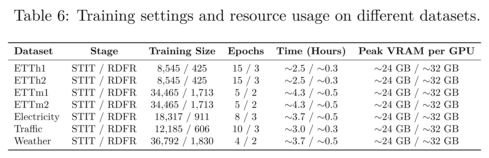
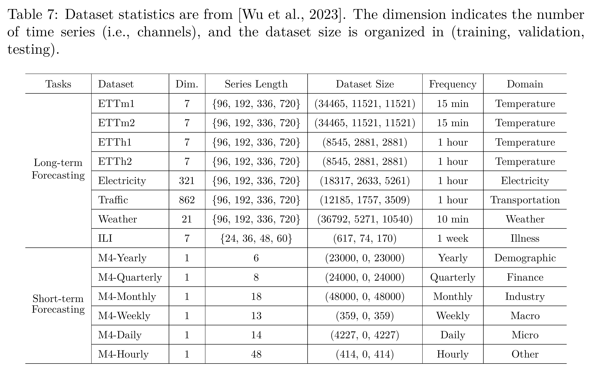
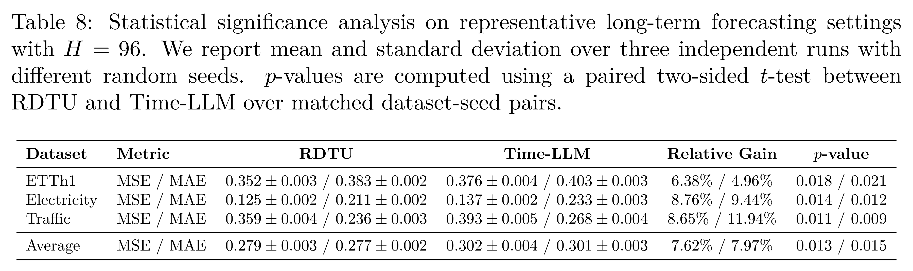
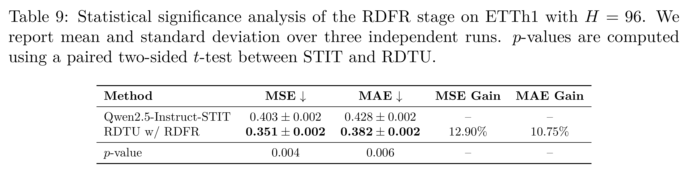

[Home](../README.md) · [Reading guide](index.md) · [Complete PDF](../supplement/RDTU-Supplementary.pdf)

# Training, datasets, metrics and statistics

<a id="appx-implementation"></a>

## Implementation

For **Stage I (STIT)**, we utilize LoRA ($`r=16, \alpha=32`$) targeting query and value modules. Optimization is performed via AdamW (learning rate $`2\times 10^{-4}`$, global batch size 32) with a cosine annealing scheduler (0.03 warmup). In **Stage II (RDFR)**, we initialize the policy from the SFT checkpoint with a reduced learning rate of $`5\times 10^{-6}`$ and a KL-divergence coefficient $`\beta_{kl}=0.04`$. We configure the Group Size $`G=8`$, sampling 8 outputs per prompt. The total reward function $`R_{total}`$ combines length consistency ($`R_{len}`$), format compliance ($`R_{fmt}`$), and prediction accuracy ($`R_{acc}`$) with a strict ratio of 1:1:8 ($`\lambda_{len}=0.1, \lambda_{fmt}=0.1, \lambda_{acc}=0.8`$), prioritizing forecasting precision. Specifically, $`R_{fmt}`$ aggregates sub-goals (number, float, precision) with weights $`\{0.2, 0.3, 0.5\}`$, while sensitivity factors are set to $`\alpha=0.5`$ for length decay and $`\beta=10.0`$ for accuracy scaling.

#### Training Budget and Resource Usage.

To further clarify the practical cost of the proposed two-stage training pipeline, we report the per-dataset training budget and resource usage in [Table S6](A-experimental-details.md#tab-training_resource). Although RDTU adopts a 7B LLM backbone, the overall training cost remains moderate. For the STIT stage, training on standard long-term forecasting benchmarks requires only about 2.5–4.3 hours, with a peak memory usage of approximately 24 GB per GPU. More importantly, the RDFR stage introduces only a small additional overhead, requiring about 0.3–0.5 hours and approximately 32 GB peak memory per GPU. This confirms that the proposed reinforcement-driven refinement is a lightweight yet effective stage: it improves numerical precision and output validity without introducing extra pre-alignment modules or substantial architectural overhead.

<a id="tab-training_resource"></a>

### Table S6

Training settings and resource usage on different datasets.

[](../assets/tables/s06.pdf)

[Original LaTeX table PDF](../assets/tables/s06.pdf)

[Download table (CSV)](../data/training_resource.csv).

## Evaluation Metrics

For evaluation metrics, we utilize the mean square error (MSE) and mean absolute error (MAE) for long-term forecasting. In terms of the short-term forecasting on M4 benchmark, we adopt the symmetric mean absolute percentage error (SMAPE), mean absolute scaled error (MASE), and overall weighted average (OWA) as in N-BEATS [Oreshkin et al., 2020](references.md#oreshkin2019n). Note that OWA is a specific metric utilized in the M4 competition. The calculations of these metrics are as follows: <a id="equ-metrics"></a>

```math
\begin{aligned} \text{MSE} &= \frac{1}{H}\sum_{h=1}^H (\mathbf{Y}_{h} - \hat{\mathbf{Y}}_{h})^2, & \text{MAE} &= \frac{1}{H}\sum_{h=1}^H|\mathbf{Y}_{h} - \hat{\mathbf{Y}}_{h}|,\\ \text{SMAPE} &= \frac{200}{H} \sum_{h=1}^H \frac{|\mathbf{Y}_{h} - \hat{\mathbf{Y}}_{h}|}{|\mathbf{Y}_{h}| + |\hat{\mathbf{Y}}_{h}|}, & \text{MAPE} &= \frac{100}{H} \sum_{h=1}^H \frac{|\mathbf{Y}_{h} - \hat{\mathbf{Y}}_{h}|}{|\mathbf{Y}_{h}|}, \\ \text{MASE} &= \frac{1}{H} \sum_{h=1}^H \frac{|\mathbf{Y}_{h} - \hat{\mathbf{Y}}_{h}|}{\frac{1}{H-s}\sum_{j=s+1}^{H}|\mathbf{Y}_j - \mathbf{Y}_{j-s}|}, & \text{OWA} &= \frac{1}{2} \left[ \frac{\text{SMAPE}}{\text{SMAPE}_{\textrm{Naïve2}}}  + \frac{\text{MASE}}{\text{MASE}_{\textrm{Naïve2}}}  \right], \end{aligned}
```

where $`s`$ is the periodicity of the time series data. $`H`$ denotes the number of data points (i.e., prediction horizon in our cases). $`\mathbf{Y}_{h}`$ and $`\hat{\mathbf{Y}}_{h}`$ are the $`h`$-th ground truth and prediction where $`h \in \{1, \cdots, H\}`$.

#### Declaration of LLM Usage.

LLMs are a core methodological component of this work. Specifically, we use Qwen2.5-Instruct as the backbone forecasting model and adapt it to time series forecasting through the proposed two-stage RDTU framework, including Supervised Temporal Instruction Tuning (STIT) and Reinforcement-Driven Forecasting Refinement (RDFR). The LLM is used to generate numerical time series predictions under structured prompts, while the training procedure, reward design, hyperparameters, and evaluation settings are documented in the paper and appendix.

## Dataset Details

<a id="tab-dataset"></a>

### Table S7

Dataset statistics are from [Wu et al., 2023](references.md#wu2022timesnet). The dimension indicates the number of time series (i.e., channels), and the dataset size is organized in (training, validation, testing).

[](../assets/tables/s07.pdf)

[Original LaTeX table PDF](../assets/tables/s07.pdf)

[Download table (CSV)](../data/dataset.csv).

## Statistical Significance Analysis

<a id="sec-statistical_significance"></a>

<a id="tab-significance_main"></a>

### Table S8

Statistical significance analysis on representative long-term forecasting settings with $`H=96`$. We report mean and standard deviation over three independent runs with different random seeds. $`p`$-values are computed using a paired two-sided $`t`$-test between RDTU and Time-LLM over matched dataset-seed pairs.

[](../assets/tables/s08.pdf)

[Original LaTeX table PDF](../assets/tables/s08.pdf)

[Download table (CSV)](../data/significance_main.csv).

To examine whether the main performance gains are statistically reliable, we repeat RDTU and the strongest language-based baseline, Time-LLM, under three independent random seeds on representative long-term forecasting settings. We select ETTh1, Electricity, and Traffic because they cover different data scales and domains, including temperature, electricity consumption, and transportation. As shown in [Table S8](A-experimental-details.md#tab-significance_main), RDTU consistently achieves lower MSE and MAE across all selected datasets. The paired two-sided $`t`$-test over matched dataset-seed pairs yields statistically significant improvements, with average $`p`$-values of $`0.013`$ for MSE and $`0.015`$ for MAE. These results indicate that the observed superiority of RDTU over language-based baselines is stable across random seeds rather than being caused by incidental initialization effects.

<a id="tab-significance_rdfr"></a>

### Table S9

Statistical significance analysis of the RDFR stage on ETTh1 with $`H=96`$. We report mean and standard deviation over three independent runs. $`p`$-values are computed using a paired two-sided $`t`$-test between STIT and RDTU.

[](../assets/tables/s09.pdf)

[Original LaTeX table PDF](../assets/tables/s09.pdf)

[Download table (CSV)](../data/significance_rdfr.csv).

We further evaluate the statistical reliability of the RDFR stage, which is the key refinement component of RDTU. Specifically, we repeat both the STIT baseline and the final RDTU model under three independent random seeds on ETTh1 with $`H=96`$. As shown in [Table S9](A-experimental-details.md#tab-significance_rdfr), RDFR consistently improves the STIT baseline across all runs, reducing MSE from $`0.403 \pm 0.002`$ to $`0.351 \pm 0.002`$ and MAE from $`0.428 \pm 0.002`$ to $`0.382 \pm 0.002`$. The paired two-sided $`t`$-test gives $`p=0.004`$ for MSE and $`p=0.006`$ for MAE, confirming that the performance gain introduced by RDFR is statistically significant. This supports our claim that RDFR reliably bridges the gap between basic instruction-following ability and high-precision numerical forecasting.

---
Source: full manuscript Appendix A. See the [coverage map](coverage.md) and [source notes](source-notes.md).
