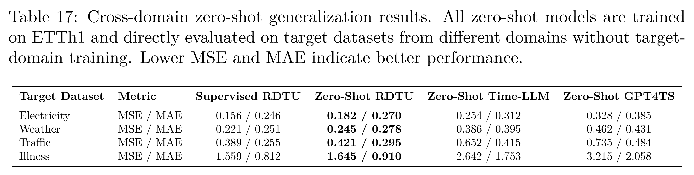

[Home](../README.md) · [Reading guide](index.md) · [Complete PDF](../supplement/RDTU-Supplementary.pdf)

# Few-shot, zero-shot and length generalization

## Few-Shot Forecasting

### Table S13

**Full few-shot forecasting results: 10% training data.** Lower values are better. Cells retain the numerical precision of the manuscript.

[Download all values (CSV)](../data/few-shot-forecasting-part1-full.csv).

[Original LaTeX table PDF](../assets/tables/s13.pdf)

[Table S13](C-generalization.md#tab-few-shot-forecasting-10per-full) evaluates data efficiency through few-shot learning on 10% training data. In this data-scarce regime, RDTU exhibits dominant generalization capabilities, with a source-reported “1st Count” of 58, while Time-LLM has a reported count of 8. The repository source notes distinguish this reported footer from a direct count of the displayed numerical minima.

### Table S14

**Full few-shot forecasting results: 5% training data.** Lower values are better. Cells retain the numerical precision of the manuscript.

[Download all values (CSV)](../data/few-shot-forecasting-part2-full-new.csv).

[Original LaTeX table PDF](../assets/tables/s14.pdf)

[Table S14](C-generalization.md#tab-few-shot-forecasting-5per-full) further investigates model robustness under extreme data scarcity by reducing the training data to 5%. Despite the limited information, RDTU maintains a strong lead over baseline methods, achieving the lowest error rates in 39 instances (“1st Count”). In comparison, the closest competitor, Time-LLM, records 10 wins, while DLinear achieves 8. Although certain long-horizon forecasts (e.g., $`H=720`$) could not be computed for some datasets due to insufficient training samples, RDTU consistently outperforms peer models on the available horizons, demonstrating superior few-shot adaptability.

## Zero-Shot Forecasting

### Table S15

**Full zero-shot ETT transfer results.** Lower values are better. Cells retain the numerical precision of the manuscript.

[Download all values (CSV)](../data/zero-shot-forecasting.csv).

[Original LaTeX table PDF](../assets/tables/s15.pdf)

[Table S15](C-generalization.md#tab-zero-shot-forecasting) presents the zero-shot learning results on ETT datasets, evaluating the transferability of models between different domains (e.g., $`ETTh1 \to ETTh2`$). RDTU demonstrates exceptional cross-domain generalization, achieving the best performance (highlighted in red) across the vast majority of transfer scenarios and horizons. While Time-LLM frequently secures the second-best position (blue) and PatchTST consistently ranks third (green), RDTU significantly outperforms both, particularly in challenging transfer tasks such as $`ETTm1 \to ETTh2`$ and $`ETTm2 \to ETTh1`$, validating the efficacy of its language-based representations for zero-shot forecasting.

## Zero-shot Length Generalization

### Table S16

Zero-shot length generalization of RDTU. Models trained only up to $`H=336`$ under the 5% data regime are directly evaluated on $`H=720`$ without additional training, and are compared with RDTU trained on $`H=720`$ using 10% data.

[Original LaTeX table PDF](../assets/tables/s16.pdf)

[Download table (CSV)](../data/length_generalization.csv).

A core advantage of RDTU is its zero-shot length generalization ability. Unlike conventional forecasting models whose output heads are often tied to a fixed prediction horizon, RDTU formulates forecasting as an autoregressive token generation task. This formulation naturally relaxes fixed output-dimensional constraints and allows the model to generate longer horizons at inference time without modifying the architecture or conducting additional horizon-specific training.

As shown in [Table S16](C-generalization.md#tab-length_generalization), RDTU trained only up to $`H=336`$ under the 5% data regime can be directly evaluated on $`H=720`$. Although a moderate performance gap is expected due to longer-horizon error accumulation, the extrapolated model remains highly competitive compared with the model trained directly on $`H=720`$ using 10% data. For example, on ETTh1, the zero-shot length extrapolation setting obtains 0.705 MSE and 0.598 MAE, which is close to the 0.694 MSE and 0.587 MAE achieved by the stronger 10% $`H=720`$ training setting. Similar trends are observed on ETTh2 and Traffic, where the performance degradation remains small despite the absence of any $`H=720`$ training samples. These results demonstrate that RDTU does not merely memorize a fixed output length, but learns a flexible generation policy that can extrapolate to unseen prediction horizons.

### Table S17

Cross-domain zero-shot generalization results. All zero-shot models are trained on ETTh1 and directly evaluated on target datasets from different domains without target-domain training. Lower MSE and MAE indicate better performance.

[Original LaTeX table PDF](../assets/tables/s17.pdf)

[Download table (CSV)](../data/cross_domain_zero_shot.csv).

## Cross-Domain Zero-Shot Generalization

To further verify whether RDTU learns transferable temporal dynamics rather than relying on dataset-specific tuning, we conduct a more challenging cross-domain zero-shot experiment. Different from the ETT-family transfer setting in [Table S4](04-experiments.md#tab-zero-shot-forecasting-brief), this experiment trains the model only on ETTh1 and directly evaluates it on target datasets from substantially different domains, including Electricity, Weather, Traffic, and Illness.

As shown in [Table S17](C-generalization.md#tab-cross_domain_zero_shot), Zero-Shot RDTU consistently outperforms zero-shot Time-LLM and GPT4TS across all target datasets. For example, on Electricity, RDTU achieves 0.182 MSE and 0.270 MAE, substantially better than Time-LLM with 0.254 MSE and 0.312 MAE. On more heterogeneous domains such as Traffic and Illness, the advantage becomes even more pronounced, indicating that RDTU maintains robust forecasting ability under severe distribution shifts. Moreover, Zero-Shot RDTU remains close to the supervised RDTU upper bound, despite using no target-domain training data. These results provide stronger evidence that the proposed direct temporal unification and reinforcement-driven refinement help the model capture intrinsic and transferable time-series patterns, rather than merely fitting dataset-specific statistics or hyperparameters.

---
Source: full manuscript Appendix C. See the [coverage map](coverage.md) and [source notes](source-notes.md).
